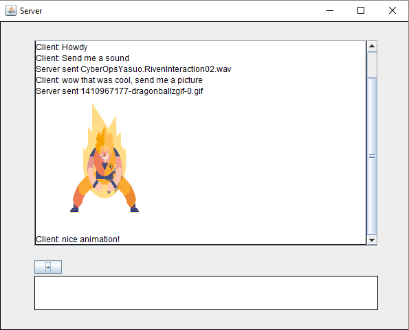

# MTP Client

### Description
A messenger application that allows a person to host a server or connect to a server and send messages, sounds, or pictures to each other.
### Features
  * Sending text
  * Sending attachments that will be played/displayed: audio (.wav), images (.bmp, .jpg, .jpeg, .gif, .png)
  * Clean codebase (for the most part) using the MVC pattern
  * Built with TCP sockets
  * GUI built using only Java's Swing and AWT libraries

### Instructions
  1. Build and run the .jar
  2. Host a server and wait for connection (need to port forward) or connect to a server
  3. Enjoy a friendly chat!